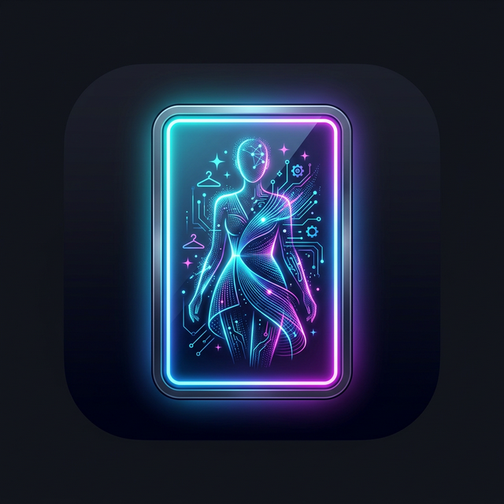
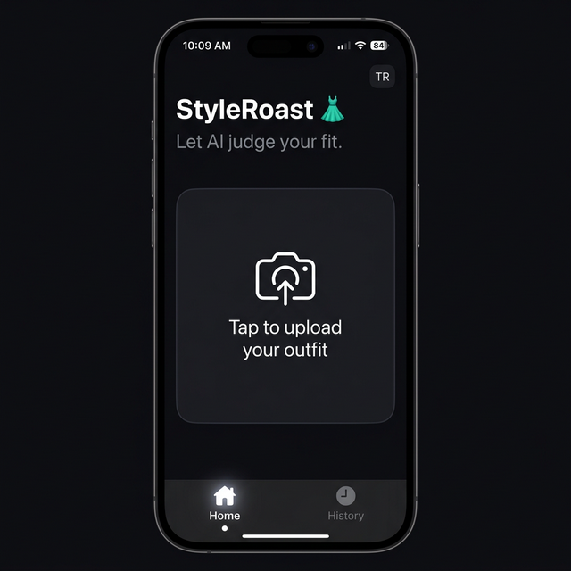
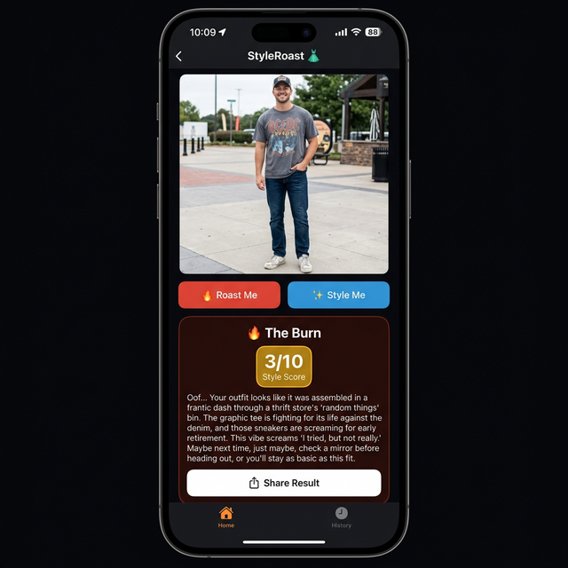
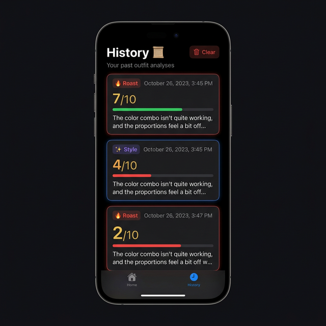

<div align="center">
  
  <h1>👗 StyleRoast – Your AI Stylist & Roaster</h1>
</div>

[](#)
[](#)
[](#)

> **"Don't let them catch you lacking! Get roasted or styled by an AI that knows fashion better than you."**

StyleRoast is an AI-powered React Native mobile application built to analyze your daily outfits. Using advanced Google Gemini Vision AI capabilities, it offers two unique modes:
1. 🔥 **Roast Me:** Get absolutely destroyed by our AI for wearing those socks with sandals.
2. ✨ **Style Me:** Receive constructive, professional advice on how to elevate your look.

Perfect for fashion enthusiasts, indecisive morning dressers, or anyone who just wants a good laugh!

<div align="center">
  <h3>📱 App Screenshots</h3>
  <p>
    
    &nbsp;&nbsp;
    
    &nbsp;&nbsp;
    
  </p>
  <p><em>Home Screen &nbsp;|&nbsp; 🔥 Roast + Score &nbsp;|&nbsp; 📜 History Tab</em></p>
</div>

---

## ✨ Features

- **📸 In-App Camera Integration:** Snap a picture of your outfit directly from the app or upload one from your gallery.
- **🤖 Advanced Vision AI:** Powered by the Google Gemini AI (1.5 / 2.5 Flash) model to deeply analyze clothing patterns, color coordination, and style trends.
- **⭐ AI Scoring System:** Each outfit gets a brutal or fair 1-10 score displayed with a stunning golden badge.
- **📤 Share Results:** Share your AI roast or style advice instantly to Instagram, WhatsApp, Twitter, and more.
- **📜 Analysis History:** All your past analyses are saved and displayed in a beautiful History tab with score progress bars.
- **🌍 Bilingual Support (EN / TR):** Switch between English and Turkish with a single tap. Both the UI and AI responses adapt to your selected language in real-time.
- **🎨 Dynamic UI/UX:** A stunning, modern interface featuring smooth animations and glassmorphism elements.
- **📱 Cross Platform:** Fully functional on both iOS and Android thanks to Expo and React Native.

## 🛠️ Tech Stack

- **Frontend:** React Native, Expo, React Navigation
- **Styling:** StyleSheet & Custom Theming
- **AI Integration:** Google Gemini API (Vision)
- **State Management:** React Hooks

## 🚀 Getting Started

Follow these instructions to get a copy of the project up and running on your local machine.

### Prerequisites

Make sure you have Node.js and Expo CLI installed on your computer.
- Node.js (v18 or higher)
- Expo Go app on your physical iOS/Android device 

### Installation

1. **Clone the repository:**
   ```bash
   git clone https://github.com/yourusername/StyleRoast.git
   cd StyleRoast
   ```

2. **Install all dependencies:**
   ```bash
   npm install
   ```

3. **Set up your Environment Variables:**
   - Create a `.env` file in the root directory.
   - Add your free Google Gemini API key:
     ```env
     EXPO_PUBLIC_GEMINI_API_KEY=your_gemini_api_key_here
     ```

4. **Start the application:**
   ```bash
   npx expo start
   ```

5. **Run on your device:**
   - Open the **Expo Go** app on your phone.
   - Scan the QR code displayed in your terminal.


